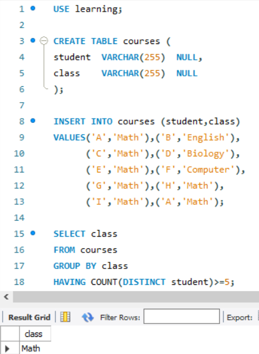
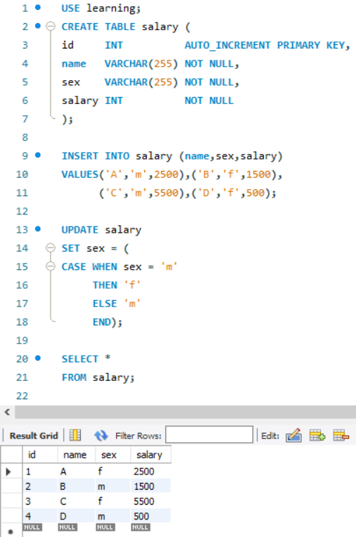
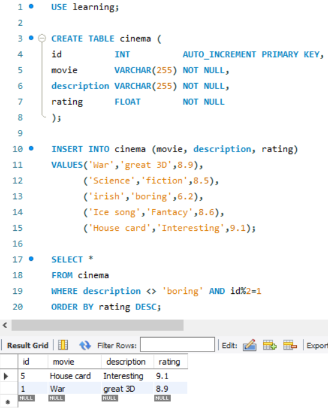
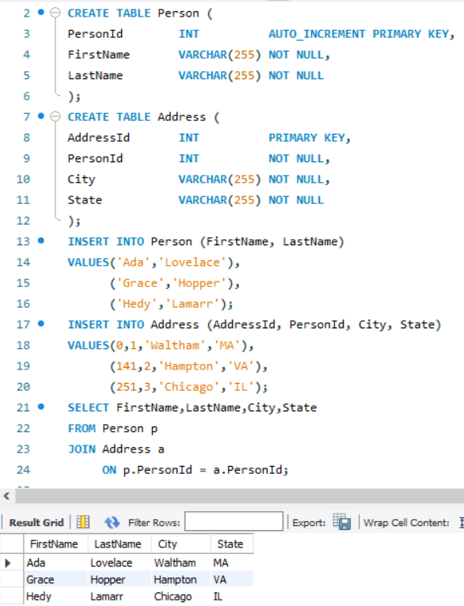
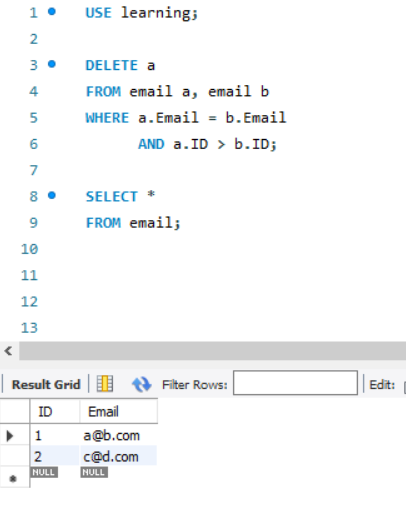
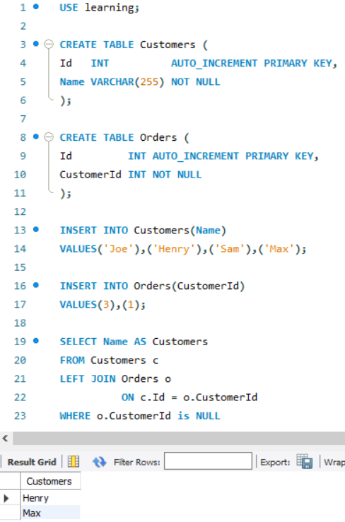
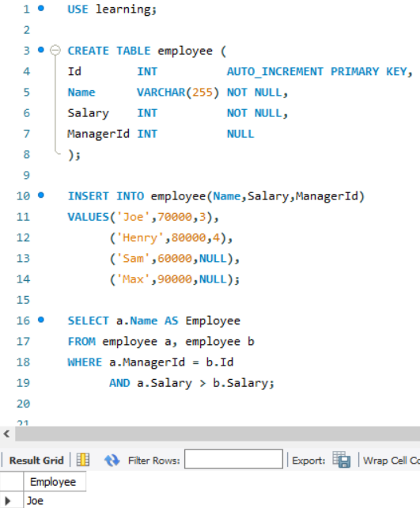

# mysql 表操作      

1. **mysql表数据类型**   

详见：[https://www.runoob.com/mysql/mysql-data-types.html](https://www.runoob.com/mysql/mysql-data-types.html)

2. **用sql语句创建表**

```mysql
CREATE TABLE 表名 (
    属性名 数据类型 [完整约束条件],
    属性名 数据类型 [完整约束条件],
    ...
    ...
    属性名 数据类型 [完整约束条件]
);
```

> 注意：在创建表前要选择数据库

|    约束条件    | 说明                                               |
| :------------: | :------------------------------------------------- |
|  PRIMARY KEY   | 标识该属性为该表的主键，可以唯一的标识对应的元组   |
|  FOREIGN KEY   | 标识该属性为该表的外键，是与之联系某表的主键       |
|    NOT NULL    | 标识该属性不能为空                                 |
|     UNIQUE     | 标识该属性的值是唯一的                             |
| AUTO_INCREMENT | 标识该属性的值是自动增加，这是MySQL的SQL语句的特色 |
|    DEFAULT     | 为该属性设置默认值                                 |

e.g

```mysql
CREATE TABLE student 
(
	id 		   INT         PRIMARY KEY      AUTO_INCREMENT,
    teacher_id INT         UNIQUE,
    name 	   VARCHAR(20) NOT NULL,
    sex        VARCHAR(10) DEFAULT 'female'
);
```

3. **用SQL语句向表中添加数据**

不指定列名

```mysql
INSERT INTO Customers
VALUES('123456',
       'Toy Land',
       '123 Any Street',
       NULL
      );
```

指定列名

```mysql
INSERT INTO Customers(cust_id,
                      cust_name,
                      cust_address,
                      cust_emial)
VALUES('123456',
       'Toy Land',
       '123 Any Street',
       NULL
      );
```

> 注意：若不给某列提供值，则不用再INSERT语句中包含它

4. **用sql语句删除表**

+ DELETE

```mysql
DELETE FROM Customers //1
WHERE cust_id = '123456' //2
```

> 注意：若省略WHERE语句，则会删除表中所有行

+ TRUNCATE

```mysql
TRUNCATE TABLE Customers
```

> 注意：此方法可删除表中所有的行，且比DELETE语句速度更快

+ DROP

```mysql
DROP TABLE Customers
```

> 注意：此语句直接删除表

5. **用SQL语句修改表**	

   + *修改列名*  

   ```mysql
   ALTER TABLE 表名 CHANGE 字段名 新字段名 字段属性
   ```

   ```mysql
   ALTER TABLE Customers 
   CHANGE id new_id int;
   ```

   + *修改表中数据*

   ```mysql
   UPDATE Customers
   SET cust_email = '123@a.com'
   WHERE cust_id = '123456';
   ```

   > 注意：若没有WHERE子句，则更新所有行；若删除某列的值，则将其更新为‘NULL'；SET 可跟多列

   + 删除行

   ```mysql
   DELETE FROM Customers 
   WHERE cust_id = '123456';
   ```

   > 注意：此做法删除整行，若删除某指定列，应用UPDATE

   + 删除列

   ```mysql
   ALTER TABLE 表名;
   DROP COLUMN 列名
   ```

   + 添加列

   ```mysql
   ALTER TABLE 表名;
   ADD COLUMN 列名 属性
   ```

## 项目三



## 项目四



## 项目五



## 项目六



## 项目七



## 项目八



## 项目九



